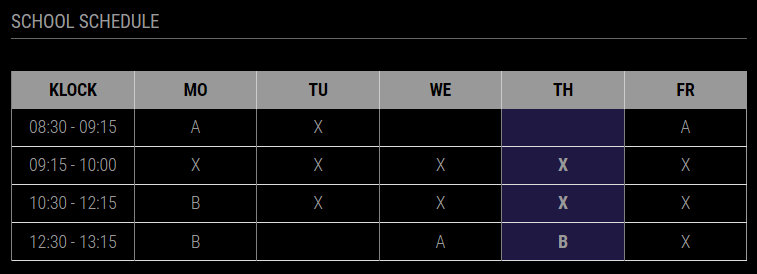

# Module for [MagicMirror](https://magicmirror.builders/): School schedule

The `MMM-school-schedule` module shows school schedule.


## Screenshot

- School schedule



## Using the module

1) Clone this repository under `MagicMirror/modules` folder
2) Run `npm install` in `MagicMirror/modules/MMM-school-schedule` folder
3) Add to the modules array in the `MagicMirror/config/config.js` file:
```javascript
modules: [
	{
		module: "MMM-school-schedule",
		position: "top_left",
		header: "School schedule",
		config: {
			schedule: {
				times: [ "08:30 - 09:15", "09:15 - 10:00", "10:30 - 12:15", "12:30 - 13:15"],
				days: {
					mo: [ "A", "X", "B", "B" ],
					tu: [ "X", "X", "X", "" ],
					we: [ "", "X", "X", "A" ],
					th: [ "", "X", "X", "B" ],
					fr: [ "A", "X", "X", "X" ]
				}
			},
			updateInterval: 1 * 60 * 60 * 1000 // every hour
		}
	}]
```

## Configuration options

The following properties can be configured:


| Option                       	| Description
| -----------------------------	| -----------
| `schedule`					| Schedule JSONObject, contains `times` and `days` keys
|								| <table><tr><td>`times`</td><td>Times String array</td></tr><tr><td>`days`</td><td>Days keys and String array of lessons. Days can be `mo`, `tu`, `we `, `th`, `fr`, `sa` or `su`. And value is Array of lessons (same length. than times Array)</td></tr></table>
| `updateInterval`				| Update interval in milliseconds, default `1800000`
